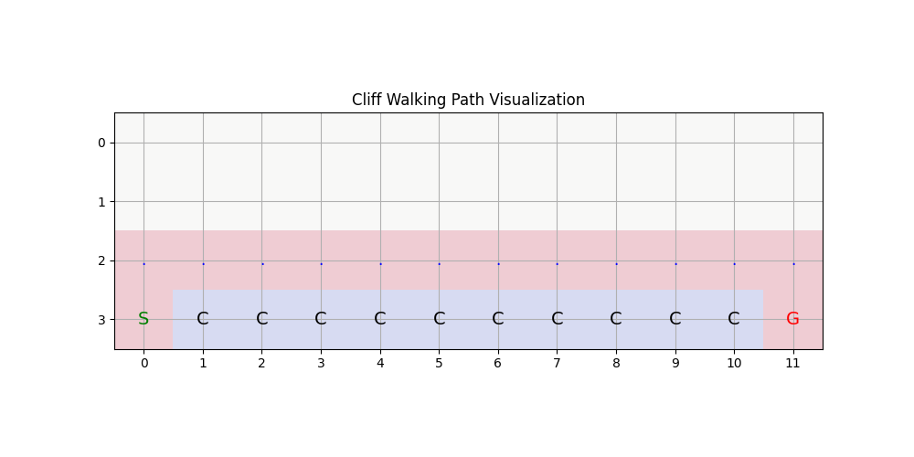
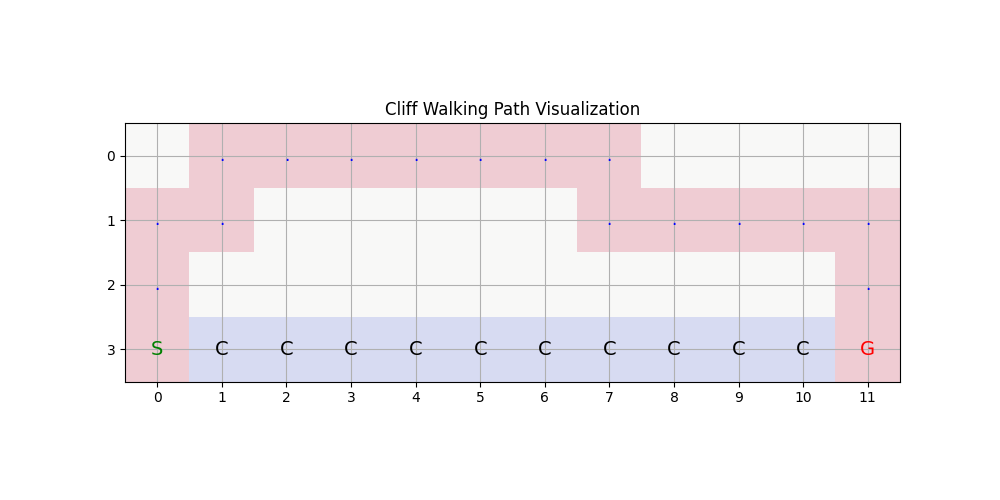
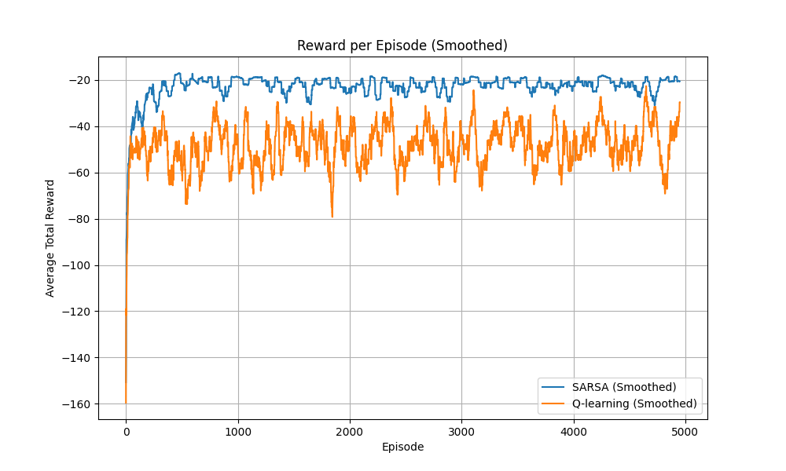

+++
date = '2025-10-13T17:22:29-04:00'
draft = false
title = '强化学习报告'
tags = ["AI", "NLP", "Deep Learning"]
categories = ["Technology"]
+++



# 强化学习实验报告 第2次

姓名:杨子昂  学号:21307181

### 一.实验题目

基于Cliff walk的例子实现Q-learning和Sarsa算法

### 二.实验内容

#### 1.Q-learning 算法原理

**Q-learning 算法**

Q-learning 是一种**无模型的强化学习算法**，通过更新状态-动作值函数 $ Q(s, a) $ 来逼近最优值函数。它是一个 **off-policy** 方法，因为更新过程中使用的动作不一定是当前策略选择的动作。

**公式与更新规则**
Q-learning 的更新规则如下：

$$
Q(s_t, a_t) \leftarrow Q(s_t, a_t) + \alpha \left[ r_{t+1} + \gamma \max_{a'} Q(s_{t+1}, a') - Q(s_t, a_t) \right]
$$

- $ Q(s, a) $：状态 $ s $ 下执行动作 $ a $ 的值函数。
- $ \alpha $：学习率，控制更新步长，范围 $ 0 < \alpha \leq 1 $。
- $ \gamma $：折扣因子，衡量未来奖励的重要性，范围 $ 0 \leq \gamma \leq 1 $。
- $ r_{t+1} $：当前步的即时奖励。
- $ \max_{a'} Q(s_{t+1}, a') $：下一状态的最大动作值，体现贪心策略。

**伪代码**

1. 初始化 $ Q(s, a) $，通常设置为零。
2. 对于每个回合：
   - 初始化初始状态 $ s_0 $。
   - 根据 $ \epsilon $-贪婪策略选择动作 $ a_t $。
   - 执行动作 $ a_t $，获得奖励 $ r_{t+1} $ 和下一状态 $ s_{t+1} $。
   - 使用更新公式更新 $ Q(s_t, a_t) $。
   - $ s_t \leftarrow s_{t+1} $。
3. 直到满足终止条件。

#### 2.Sarsa算法原理

**SARSA 算法**

SARSA 是一种**无模型的强化学习算法**，与 Q-learning 类似，但它是一个 **on-policy** 方法，更新值函数时依赖于当前策略选择的动作。

**公式与更新规则**
SARSA 的更新规则如下：

$$
Q(s_t, a_t) \leftarrow Q(s_t, a_t) + \alpha \left[ r_{t+1} + \gamma Q(s_{t+1}, a_{t+1}) - Q(s_t, a_t) \right]
$$

- $ Q(s, a) $：状态 $ s $ 下执行动作 $ a $ 的值函数。
- $ a_{t+1} $：下一状态 $ s_{t+1} $ 上根据当前策略选择的动作。
- 其他符号与 Q-learning 中含义相同。

**伪代码**

1. 初始化 $ Q(s, a) $，通常设置为零。
2. 对于每个回合：
   - 初始化初始状态 $ s_0 $。
   - 根据 $ \epsilon $-贪婪策略选择初始动作 $ a_0 $。
   - 对于每一步：
     - 执行动作 $ a_t $，获得奖励 $ r_{t+1} $ 和下一状态 $ s_{t+1} $。
     - 根据当前策略选择下一动作 $ a_{t+1} $。
     - 使用更新公式更新 $ Q(s_t, a_t) $。
     - $ s_t \leftarrow s_{t+1} $，$ a_t \leftarrow a_{t+1} $。
3. 直到满足终止条件。

#### 3.算法区别

| 特性     | Q-learning                       | SARSA                          |
| -------- | -------------------------------- | ------------------------------ |
| 策略类型 | Off-policy                       | On-policy                      |
| 更新方式 | 基于贪心动作更新$ \max Q $     | 基于策略选取的动作更新$ Q $  |
| 收敛特性 | 对探索不敏感，容易收敛到最优策略 | 收敛更稳定，但策略选择影响较大 |

### 二.关键代码

#### 1.Q-learning代码

```python
def q_learning(env, episodes=500, alpha=0.1, gamma=0.99, epsilon=0.2):
    q_table = np.zeros((env.grid_height, env.grid_width, 4)) 
    for episode in range(episodes):
        state = env.reset()
        done = False

        while not done:

            if random.uniform(0, 1) < epsilon:
                action = random.randint(0, 3) 
            else:
                action = np.argmax(q_table[state[0], state[1]]) 


            next_state, reward, done = env.step(action)
            best_next_action = np.argmax(q_table[next_state[0], next_state[1]])


            q_table[state[0], state[1], action] += alpha * (
                reward + gamma * q_table[next_state[0], next_state[1], best_next_action]
                - q_table[state[0], state[1], action]
            )
            state = next_state

    return q_table
```

这段代码实现了 Q-learning 算法，通过一个 $ Q $s-表存储每个状态-动作对的值，并逐步更新以逼近最优策略。核心逻辑是反复运行多回合（`episodes`），每回合从环境初始状态开始，利用 $ \epsilon $s-贪婪策略选择动作：以概率 $ \epsilon $s 随机探索动作，或以 $ 1-\epsilon $s 的概率选择当前状态下 $ Q $s-值最大的动作。执行动作后，通过环境反馈获取即时奖励和下一状态，基于 Q-learning 的更新公式调整当前状态-动作的 $ Q $s-值，公式为 $ Q(s, a) \leftarrow Q(s, a) + \alpha [r + \gamma \max_a Q(s', a) - Q(s, a)] $s，注意这里更新的时候所选择的是回报最大的步骤，可能和刚才用贪婪策略所选择的步骤不相同。更新完成后将状态转移至下一状态，直到回合结束。最终返回更新后的 $ Q $s-表，用于推导最优策略。

#### 2.Sarsa算法代码

```python
def sarsa(env, episodes=500, alpha=0.1, gamma=0.99, epsilon=0.2):
    q_table = np.zeros((env.grid_height, env.grid_width, 4)) 

    for episode in range(episodes):
        state = env.reset()

        if random.uniform(0, 1) < epsilon:
            action = random.randint(0, 3)
        else:
            action = np.argmax(q_table[state[0], state[1]])
  
        done = False

        while not done:
            next_state, reward, done = env.step(action)

            if random.uniform(0, 1) < epsilon:
                next_action = random.randint(0, 3)
            else:
                next_action = np.argmax(q_table[next_state[0], next_state[1]])

            q_table[state[0], state[1], action] += alpha * (
                reward + gamma * q_table[next_state[0], next_state[1], next_action]
                - q_table[state[0], state[1], action]
            )
            state, action = next_state, next_action

    return q_table
```

这里的代码实现和刚才的Q-learning代码实现十分相似，主要的区别在于转移状态时，算法会使用贪婪策略来更新Q值，并非是一直默认使用Q值最大的动作，这使得算法能够探索更多的可能，并作出更为保守的选择。

### 三.实验结果及分析

#### 1.Q-learning结果图


可以看到Q-learning得出的结果非常激进，为了更快的到达终点，选择贴着悬崖的路。

#### 2.Sarsa结果图


相比于Q-learning得出的结果，Sarsa的结果就明显更加保守，会选择远离悬崖高负奖励的路线。在路线前期可能是主要为了避免悬崖，所选择了最远离的位置，随着距离终点的距离拉近，算法开始靠近悬崖以获得更短的路程，但是依旧和悬崖之间隔着一格，还是很保守的策略。

#### 3.reward曲线



1. **总体趋势**

- **SARSA**（蓝色曲线）：

  - 随着训练回合数的增加，奖励逐渐增加，并在早期（大约第500回合）趋于稳定。
  - 最终收敛在一个较高的奖励值附近（约-20），波动较小，表现更为稳定。
- **Q-learning**（橙色曲线）：

  - 奖励同样随着训练回合数逐渐上升，但相比SARSA，其波动更大，训练过程不够平稳。
  - 最终的收敛奖励值（约-40）明显低于SARSA。

2. **平稳性对比**

- SARSA采用了on-policy方法，因此在探索过程中避免了过于激进的行为，导致训练曲线更平滑、奖励更高。
- Q-learning是off-policy方法，这可能导致更大的波动和不稳定的学习表现，特别是在探索阶段。

3. **算法性能对比**

- **收敛速度**：SARSA稍快于Q-learning，其奖励在约500回合达到稳定，而Q-learning需要更长时间才趋于稳定。
- **最终性能**：SARSA的平均奖励值更高，说明在该任务中SARSA策略更适合。
- **波动性**：Q-learning的波动性较大，表现出不稳定性。

应根据不同的任务场景选择不同的算法。
